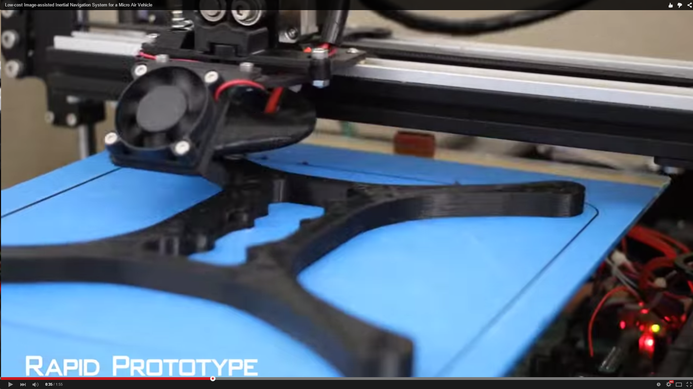
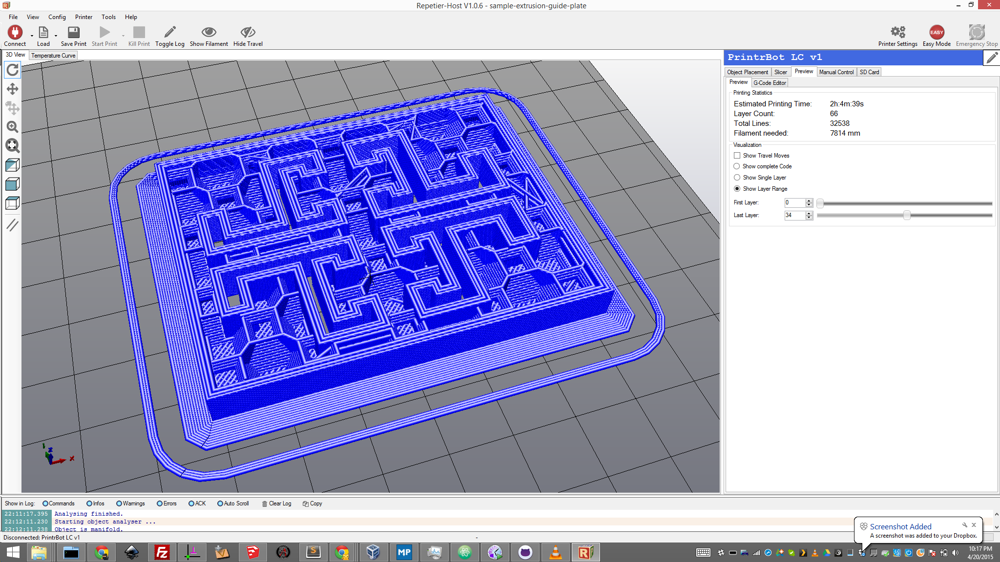
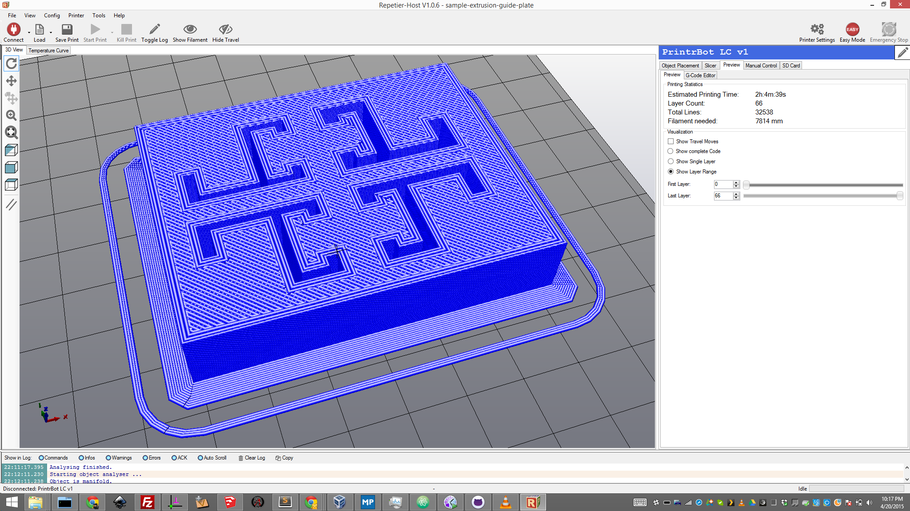

# Printrbot LC v1.0 Upgrade

### 2015-04-20
I found a cheap  picture frame make out of aluminium extrusion @ Michaels for $2, and it occured to be that i could make a much more rigid and smooth x axis shuttle for my printerbot.

### Example design

